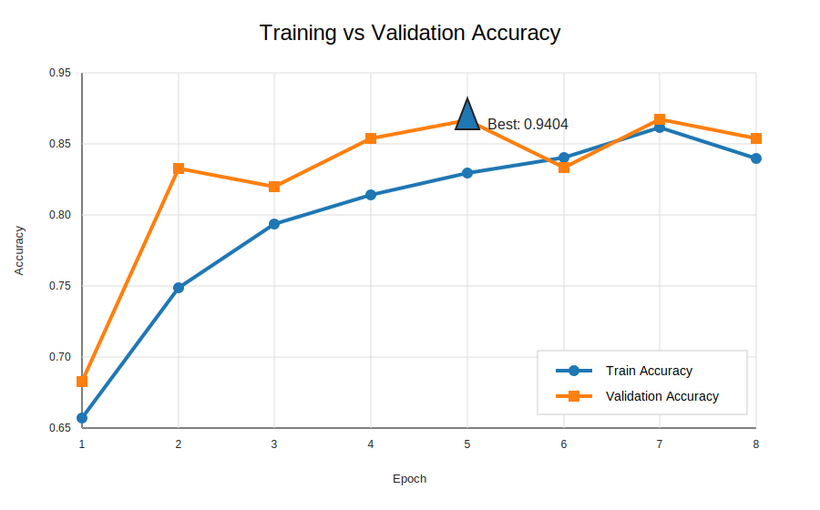

# monolayerfff-resnet50

ResNet50 transfer learning for the **MonolayerFFF** image-classification dataset.

This repo takes the MonolayerFFF dataset from the IEEE Access paper and trains a ResNet50-based classifier for the same three printing-condition classes: **D1**, **D2**, and **H**.

---

## Dataset

The MonolayerFFF paper introduces a public image dataset for Fused Filament Fabrication (FFF) 3D printing process monitoring. The dataset focuses only on monolayer parts, which makes it different from older FFF datasets built around full multi-layer parts.

| Detail | Value |
|---|---:|
| Total images | 776 |
| Defect 1 images | 274 |
| Defect 2 images | 231 |
| Regular images | 271 |
| Image type | Surface images of monolayer FFF parts |
| Part size | 25 x 25 x 0.4 mm |
| Classes | D1, D2, H |
| Augmentation in paper dataset | None |

The parts were printed using blue PLA filament, scanned at 600 dpi, segmented with OpenCV, and saved as individual PNG images.

---

## Classes

| Class | Meaning | What changed during fabrication |
|---|---|---|
| H | Regular part | No induced defect |
| D1 | Defect 1 | Reduced filament deposition in specific contour regions |
| D2 | Defect 2 | Filament retraction on the middle raster line |

Both D1 and D2 are designed to mimic under-extrusion, just in different regions of the printed part. Tiny defect, big classification headache. Naturally.

---

## Paper setup

The paper evaluates the dataset using **GoogLeNet** in MATLAB.

| Item | Paper setup |
|---|---|
| Model | GoogLeNet |
| Framework | MATLAB |
| Split | 70% train, 30% validation |
| Optimizer | SGDM |
| Batch size | 32 |
| Epochs | 25 |
| Learning rate | 0.001 |
| Dropout | 50% |
| Best validation accuracy | 95.81% |

The paper also used a separate test set with 40 images per class. That test set was produced using the same printing and scanning method, but it was not part of the main MonolayerFFF dataset.

---

## Our setup

This repo reimplements the classification pipeline using **PyTorch** and **ResNet50**.

| Item | This repo |
|---|---|
| Model | ResNet50 |
| Framework | PyTorch |
| Input size | 224 x 224 |
| Split | 80% train, 20% validation |
| Batch size | 16 |
| Max epochs | 20 |
| Early stopping patience | 3 |
| Optimizer | Adam |
| Learning rate | 0.0001 |
| Loss | Cross entropy |
| Classes | 3 |
| Best validation accuracy | 94.04% |

The ResNet50 backbone starts with ImageNet weights. Most of the backbone is frozen, while the final ResNet block is unfrozen for fine-tuning. The original classifier is replaced with a dropout layer and a final linear layer for the three MonolayerFFF classes.

---

## Paper vs our implementation

| Area | Paper | This repo |
|---|---|---|
| Backbone | GoogLeNet | ResNet50 |
| Framework | MATLAB | PyTorch |
| Train / validation split | 70 / 30 | 80 / 20 |
| Optimizer | SGDM | Adam |
| Batch size | 32 | 16 |
| Max epochs | 25 | 20 with early stopping |
| Learning rate | 0.001 | 0.0001 |
| Data augmentation | No augmentation for dataset composition | Training transforms include flip, rotation, color jitter, and random resized crop |
| Best validation accuracy | 95.81% | 94.04% |

The paper’s GoogLeNet result is slightly higher, but our ResNet50 setup gets close with a smaller validation split, different optimizer, different training code, and a shorter run. Not bad for a repo that initially had a README full of placeholders. Character development, unfortunately.

---

## Result

| Metric | Value |
|---|---:|
| Best validation accuracy | **0.9404** |
| Best epoch marked in graph | 5 |
| Final training accuracy | ~0.912 |
| Final validation accuracy | ~0.927 |
| Total epochs shown | 8 |

Validation accuracy rises quickly and stays close to training accuracy, which suggests the model learned the key visual differences without obvious severe overfitting in this run.

---

## Files

| File | Purpose |
|---|---|
| `create_csv_split.py` | Builds train and validation CSV files from the image folders |
| `prepare.py` | Alternate CSV split script using a relative parent dataset path |
| `csv_dataset.py` | CSV-based dataset helper |
| `train_resnet50.py` | Main ResNet50 training script |
| `test.py` | Quick PyTorch / CUDA check |
| `details.txt` | Paper and dataset reference links |
| `assets/graph.svg` | Clean result graph used in this README |

---

## Source

Paper: **MonolayerFFF: An Image Dataset of MonolayerFFF 3D Printed Parts With Different Fabrication Conditions**

Dataset: **MonolayerFFF**, Mendeley Data V2  
https://data.mendeley.com/datasets/k66f2gbgb4/2
