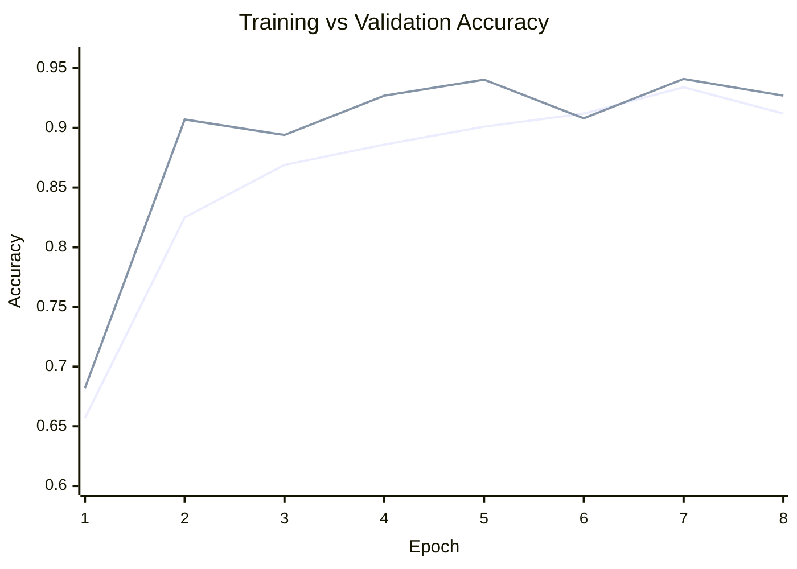
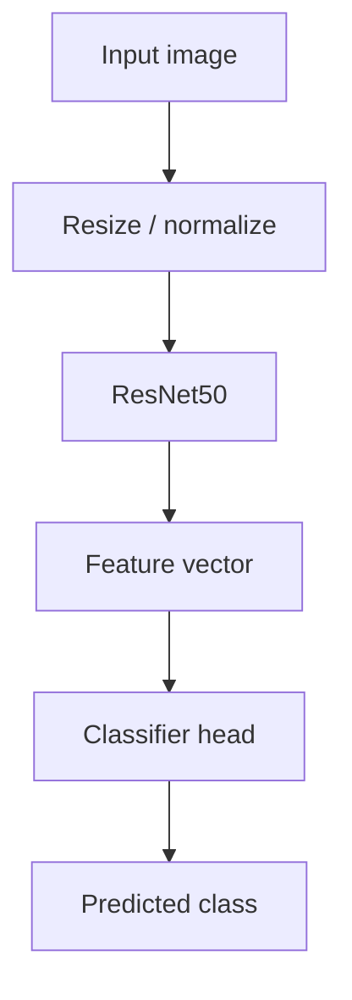

# monolayerfff-resnet50

ResNet50 transfer learning for monolayer FFF image classification.

This repo is a practical implementation around the dataset and paper linked in `details.txt`. The goal is simple: use image data from the monolayer FFF work, train a ResNet50-based classifier, and compare training and validation performance across epochs.

---

## Source material

| Source | What it adds |
|---|---|
| `details.txt` | Paper and dataset reference links |
| IEEE paper | Background for the dataset and task |
| This repo | ResNet50-based setup and training result |

Paper links from `details.txt`:

- https://ieeexplore.ieee.org/abstract/document/11143237
- https://ieeexplore.ieee.org/stamp/stamp.jsp?tp=&arnumber=11143237

---

## Setup

The implementation uses ResNet50 as the main feature extractor and adds a classifier head for the monolayer FFF task. It follows the paper/dataset direction, but keeps the training setup focused and lightweight.

---

## Paper vs this implementation

| Part | Paper / dataset reference | This repo |
|---|---|---|
| Task | Monolayer FFF image classification | Same task focus |
| Input | Image dataset referenced in the paper | Images are passed through preprocessing |
| Model idea | Deep learning for visual classification | ResNet50 transfer learning |
| Output | Class prediction and model performance | Accuracy tracked across 8 epochs |
| Best result here | - | **0.9404 validation accuracy** |

---

## Training result

Your run reached a best validation accuracy of **0.9404**. Training accuracy improved steadily, and validation accuracy stayed strong across most epochs. Nice little curve, honestly. The model did not embarrass itself, which is more than can be said for most group projects.

| Metric | Value |
|---|---:|
| Best validation accuracy | **0.9404** |
| Epoch marked as best in the result graph | 5 |
| Final training accuracy | 0.912 |
| Final validation accuracy | 0.927 |
| Total epochs | 8 |

---

## What the curve shows

| Observation | Meaning |
|---|---|
| Validation accuracy jumps after epoch 1 | ResNet50 features transfer well to this image task |
| Training accuracy rises steadily | The model keeps adapting across epochs |
| Validation stays close to training | No obvious severe overfitting in this run |
| Best score appears around the middle | The strongest checkpoint is around epoch 5 |

---

## Model flow

---

## Quick takeaway

This repo adapts ResNet50 to the monolayer FFF classification problem referenced in `details.txt`. The current training run reaches **94.04% validation accuracy**, which gives a strong baseline for comparing future model changes.