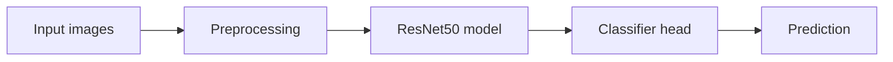
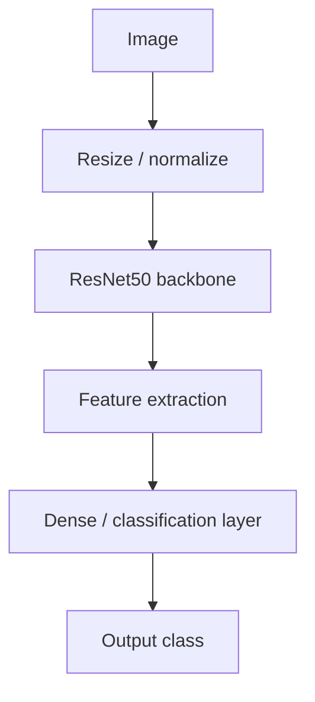
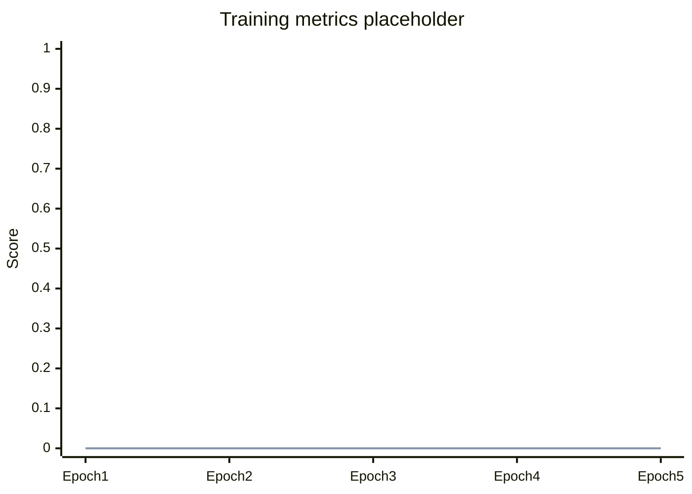

# monolayerfff-resnet50

A ResNet50-based project for monolayer FFF image classification.

The repo name gives the core idea. The deeper details, like dataset size, class labels, training setup, and final scores, are not documented in the repo yet. So this README stays useful without pretending to know things it does not. Revolutionary, apparently.

---

## What this project does

This project is built around a simple workflow:

The goal is to use ResNet50 features to classify monolayer FFF image data.

---

## Project snapshot

| Area | Status |
|---|---|
| Model | ResNet50 |
| Task | Image classification |
| Dataset | Not documented yet |
| Classes | Not documented yet |
| Training results | Not documented yet |
| Inference steps | Not documented yet |

---

## Model flow

---

## Training overview

| Step | Description |
|---|---|
| 1 | Load image dataset |
| 2 | Apply preprocessing |
| 3 | Train or fine-tune ResNet50 |
| 4 | Evaluate model performance |
| 5 | Use trained model for prediction |

---

## Result tracking

Training metrics can be added here once the run details are available.

| Metric | Value |
|---|---:|
| Accuracy | Not documented yet |
| Loss | Not documented yet |
| Precision | Not documented yet |
| Recall | Not documented yet |
| F1 score | Not documented yet |

---

## Confusion matrix

Add the real class labels and counts here after evaluation.

| Actual / Predicted | Class 1 | Class 2 | Class 3 |
|---|---:|---:|---:|
| Class 1 | - | - | - |
| Class 2 | - | - | - |
| Class 3 | - | - | - |

---

## Repository contents

The available files should be checked directly in the repo. This README only adds project documentation and does not change the code.

---

## Notes

This README is intentionally short. Once the dataset details, training script, and model results are added, the placeholders above can be replaced with real numbers and plots.